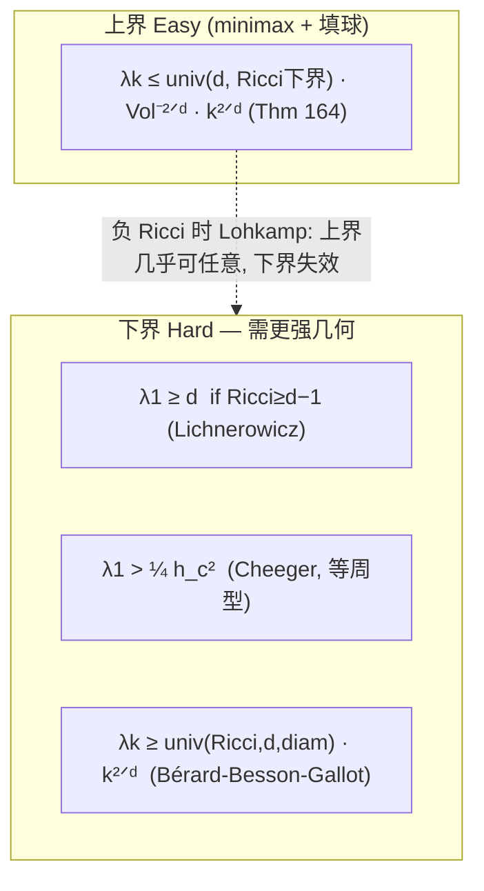

# 第一特征值 The First Eigenvalue λ₁

## 直觉 Intuition

$\lambda_1$ 是鼓的**最低非零音**——"基音"。它控制一切慢模式: 平均值为零的函数的 Dirichlet 商下界、共振是否发生、甚至纯度量几何(经距离函数, Colding 公式)。Berger 反复强调: **下界才是真正的奖品**, 上界便宜易得。而下界之所以难, 是因为它需要"正曲率"这种强几何假设——负曲率几乎管不住 $\lambda_1$(见 [[Heat-Kernel-Asymptotics]] 的 Lohkamp)。

## 详细解释 Detailed

### 为何 $\lambda_1$ 关键 Why λ₁ matters
- 控制 $\int\|df\|^2 \ge \lambda_1\int f^2$ (对 $\int f=0$ 的 $f$) —— 偏微分方程的能量估计基石。
- 控制共振: 大 $\lambda_1$ 阻止低频共振。
- 经 Colding 距离函数公式, 间接控制纯度量几何。

### Lichnerowicz 定理 Lichnerowicz theorem
**Thm 181 (Lichnerowicz 1958):** 若 $\mathrm{Ricci}\ge d-1$ (标准 $d$ 维球面 Ricci), 则 $\lambda_1\ge d$ (球面的 $\lambda_1$), 等号仅当等距于球面 (Obata 1962)。

证明极美, 用 **Bochner 公式** 作用在第一特征函数 $f$ 的微分 $df$ 上 (因 $\Delta f=\lambda_1 f$, $df$ 非调和但近似):
$$0=\int_M\|\mathrm{Hess}\,f\|^2 - \lambda_1\int_M\|df\|^2 + \int_M\mathrm{Ricci}(df,df).$$
再用 Newton 不等式 $\|\mathrm{Hess}\,f\|^2\ge\frac{(\Delta f)^2}{d}=\frac{\lambda_1^2 f^2}{d}$ 与 $\mathrm{Ricci}\ge(d-1)\|df\|^2$, 整理得 $\lambda_1\ge d$。

对比 [[Heat-Kernel-Asymptotics]] 的 Thm 172 (一般 $\lambda_k$ 下界, 含直径) 在 $\lambda_1$ 上是 Lichnerowicz 的改进(可用于 Ricci 非负甚至负的情形)。

### Cheeger 常数 Cheeger's constant
$h_c$ = 任意超曲面切片把 $M$ 分成两块时 $\frac{\mathrm{Area}(\text{切面})}{\min(\mathrm{Vol}_1,\mathrm{Vol}_2)}$ 的下确界。
**Thm 182 (Cheeger 1970):** $\lambda_1 > \frac14 h_c^2$。Buser 1978 证最优(但光滑度量取不到等号)。

### 曲面: Hersch 与仅由面积的上界 Surfaces: Hersch
**Thm 183 (Hersch 1970):** 球面 $S^2$ 上任意黎曼度量,
$$\frac1{\lambda_1}+\frac1{\lambda_2}+\frac1{\lambda_3}\ge\frac{3}{8\pi\,\mathrm{Area}(S^2,g)},$$
等号仅标准球面。特别 $\lambda_1<\frac{8\pi}{3\,\mathrm{Area}}$。证明混三件事: (1) minimax; (2) 曲面 Dirichlet 商在共形变换下不变; (3) $S^2$ 共形群足够大, 可把任意密度的质心移到原点。

注意: $\dim\ge3$ 时**不存在**仅依赖体积的 $\lambda_1$ 上界 (Dodziuk 1993, 造大直径反例)——曲面例外。

### 重数与拓扑 Multiplicity & topology
$\dim\ge3$: **Thm 186 (Colin de Verdière 1987)** 任意有限谱(含重数)可实现 → $\lambda_1$ 重数可任意大。
曲面: $\lambda_1$ 重数被亏格控制(用节点线结构 + Bers 奇点分析 + 代数拓扑; Besson 1980, Yang–Yau 1980)。球面最优=3, 环面最优=6。**Conjecture 187 (Colin de Verdière):** 曲面 $\lambda_1$ 最高重数 $=\mathrm{Chrom}(M)-1$ (色数−1)。

### Kähler: Bourguignon–Li–Yau
**Thm 184 (1994):** $CP^n$ 上任意度量 $\lambda_1\le\frac{(n+1)\pi^{n/n!}}{\mathrm{Vol}(CP^n,g)}$ (用双全纯变换群代替球面共形群)。注意: 谱稳健, 但"Kähler"不稳健 → Kähler 谱理论受限。

## 图解 Diagram: 下界所需假设的层级

## 为什么重要 Why

- $\lambda_1$ 是连接"曲率(局部) ↔ 谱(全局) ↔ 拓扑(重数)"的最直接量。
- Lichnerowicz 是 Bochner 技术的范式——用曲率消灭/控制调和场, 进而下界特征值。这是整个 Bochner–Yau 流派的源头。
- 曲面重数控制展示"谱含拓扑信息"的最干净案例(高维失败)。

## 连接 Connections
- ← [[Spectrum-of-Laplacian]]: minimax 给上界; ← [[Heat-Kernel-Asymptotics]]: Thm 172 给一般 $\lambda_k$ 下界。
- → [[Isospectral-Manifolds]]: $\lambda_1$ 重数在高维可任意(Colin de Verdière Thm 186)是反谱问题的关键工具。
- → [[Wave-Equation-Length-Spectrum]]: $\lambda_1$ 与周期测地线有深层联系 (§9.9, Thm 205)。
- 跨课程: Bochner 技术在复几何/Kähler 几何中独立成派; Myers 定理(比较定理)与 Lichnerowicz 平行。

## 来源 Sources
- Berger Ch.9 §§9.10 (pp. 408–412), §§9.13.1 (Riemann 曲面). 见 [[Riemann-ch9]]。
- Buser 1992 [292]; Nadirashvili 1996 [964]; Dodziuk 1993 [453].

## 待解决 Open Questions
- 曲面(除球面、环面外) $\lambda_1$ 上界的最优常数未定。
- Conjecture 187 (重数 = 色数−1) 未证。
- 仅依赖体积的 $\lambda_1$ 上界在 $\dim\ge3$ 不存在; 能否找到最弱的附加几何条件?
