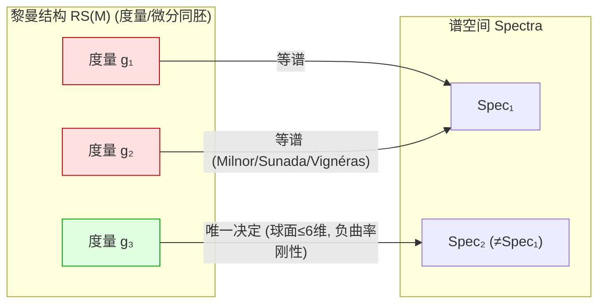

# 等谱流形 Isospectral Manifolds

## 直觉 Intuition

Kac 1966 的著名问题: **"能听出鼓的形状吗?"** 把流形当鼓, 敲击听其全部频率(谱), 能否还原形状? Berger 把这称为反谱问题。答案戏剧性地是 **"不完全能"**: Milnor 1964 造出两个 16 维平环, 谱完全相同却不等距。但"听"也不是全无收获——负曲率流形刚性极强(等谱形变不存在), 标准球面 $\le6$ 维由谱唯一决定。本章的反谱问题揭示了"谱这一不变量到底记住/忘记了什么"——这是整章最高视角的检验场。

## 详细解释 Detailed

### 反谱映射 The inverse map
研究映射 $\mathrm{Spec}:\mathrm{RS}(M)\to\{\mathbb{R}_+\text{ 离散子集}\}$ (黎曼结构 = 度量模微分同胚)。两个问题: (1) 像(image)是什么? (2) 这映射单射吗? 不单射时原像有何结构?

> 直白事实 (Green ~1960): 若不仅知特征值还知**特征函数**, 则度量被唯一决定(homophonic)——因特征函数完备 → 知 $\Delta$ 作用 → 由坐标公式恢复 $g_{ij}$。

### 非唯一性: 反例 Nonuniqueness
- **Milnor 1964:** 两个 16 维平环等谱不等距。平环谱 = 对偶格 $\Lambda^*$ 点模平方的 $4\pi^2$ 倍 → 等价于两格 $\Theta_\Lambda(z)=\sum N_m q^m$ (theta 级数)相同。取 $\Lambda=E_8\times E_8$ 与 $\Lambda=E_{16}$: theta 级数相同(Serre 1973), 但格不等距。
  - 维数可降到 4 (Conway–Sloane); 维数 3 时则唯一(Schiemann)——只需谱前有限项。
- **Vignéras 1980:** 否定 Gel′fand 1962 关于 Riemann 曲面唯一的猜想——用四元数数域造等谱不等距 Riemann 曲面。
- **Sunada 1985:** 给出代数充分条件——两离散子群满足某群论条件 ⇒ 等谱商。统一并大量生产反例。
- **Gordon 等 1990s:** 推广到局部齐性、非齐性、单参形变; 甚至球面上可造等谱对(Szabo 2001, 可任意接近标准度量)。
- 平面等谱区域也是从等谱 Riemann 曲面(无边界)移植得到的。

### 像的描述 Image of the map
**Thm 186 (Colin de Verdière 1987):** $\dim\ge3$ 时, 任意有限正实数子集(含指定重数)都可作为某黎曼结构的谱**开头**。证明: 在 $M$ 上放点当振子, 用不相交曲线连接, 管状邻域化, "隧道效应"控制——等价于先找图谱匹配的图, 再实现为流形。$\dim2$ 时曲线必相交 → 与 [[First-Eigenvalue]] 中 $\lambda_1$ 重数被亏格控制一致。
**Thm 167 (Lohkamp 1996):** 更戏剧——固定体积与 $\int\mathrm{scalar}$, 谱前 $m$ 项任意, 同时 $U_{2k}\to+\infty$, $U_{2k+1}\to-\infty$。说明 $U_k$ 与负 Ricci 假设几乎无效。

### 有限性/紧致性 Finiteness / compactness
- **Thm 188 (Osgood–Phillips–Sarnak):** 任意给定谱, 曲面上具该谱的黎曼结构集合**紧致**。关键工具: 热不变量 + **Laplacian 行列式** $\det\Delta=\prod\lambda_i$ (经 $\zeta(s)=\sum\lambda_i^{-s}$, $\zeta'(0)$ 正则化)。
- 高维紧致性开放; $\dim3,4$ 有部分结果(Anderson, Brooks–Perry–Petersen)。存在单参等谱形变 → 高维不可能有限。
- Riemann 曲面: 给定亏格 $\gamma$ 至多 $\exp(720\gamma^2)$ 个等谱不等距 (Thm 197, Buser)。

### 唯一性与刚性 Uniqueness & rigidity
- 标准球面 $\le6$ 维由谱唯一决定(Tanno 1980, 用高阶 $U_k$); $>6$ 维开放。
- 平环、$RP^2$ 由谱决定。
- **Thm 189 (Guillemin–Kazhdan 1980, Croke–Sharafutdinov 1997):** 负曲率紧流形**无等谱形变**。证明极漂亮(曲面): 在 $UM$ 上做 Fourier 分析(纤维为圆), 形变函数 $t\in H_{-2}\oplus H_0\oplus H_2$(度量是二次型); 等谱 ⇒ 周期测地线长度不变 ⇒ $t$ 沿任一周期测地线积分为零; 负曲率使周期测地线稠密 ⇒ (Livtsic) $t$ 沿测地流是某 $s$ 的导数, $s\in H_1\oplus H_0\oplus H_{-1}$; 但 $s$ 又应在 $H_2\oplus H_0\oplus H_{-2}$ ⇒ $t$ 沿纤维常值 ⇒ 形变平凡。
- **Conjecture 190 (Besson–Courtois–Gallot):** $\dim>2$ 等谱紧负曲率流形等距。
- 等谱 ⇒ 长度谱相同(Thm 176); 但长度谱相同 ≠ 等谱(Vignéras)。**标记长度谱**(带基点)在负曲率 $\dim>2$ 决定度量, 支持猜想。

### Riemann 曲面特例 Riemann surfaces special case
Huber 定理: 函数谱 $\Leftrightarrow$ 长度谱。使大量几何方法(裤分解、扭转角)可解谱问题。Wolpert/Buser: 有限部分长度谱(或函数谱, 加内射半径下界)决定整个谱; 存在"孤独"曲面(无等谱伙伴)。小特征值理论: $\lambda\in(0,1/4]$ 的"小特征值"个数有界 ($\lambda_{4\gamma-2}>1/4$, Thm 193) 但 $[0,1/4+\varepsilon]$ 内无界 (Thm 194)。

### 外形式谱 Spectrum of exterior forms
$\Delta$ 作用在 $p$-形式上也有谱 $\{\lambda_{p,k}\}$; 核 = 调和形式 $\cong H^p_{\mathrm{dR}}(M)$, 维数 $b_p$。McKean–Singer 交替求和 $\sum_{p,k}(-1)^p e^{-\lambda_{p,k}t}$ 的奇妙**逐点抵消**(Patodi 1971) → 只剩 $\sum(-1)^p b_p=\chi(M)$ → 引出 Atiyah–Bott–Patodi 指标定理新证。**η 不变量**(Atiyah–Patodi–Singer 1975): $\eta(s)=\sum_{\lambda\ne0}\mathrm{sign}(\lambda)|\lambda|^s$, $\eta(0)$ 测"谱不对称性", 用于带边流形的符号差公式 $\sigma(M')=\int_{M'} L(R)-\eta(M)$。

## 图解 Diagram: 谱映射的像与纤维

## 为什么重要 Why

- 反谱问题是整章的"试金石": 检验前述所有正向结果(热核、波方程、$\lambda_1$)到底给出了多少可逆信息。结论: 单个工具都不够, 组合也只够低维/特殊情形。
- "能听出形状吗"是数学史上最出圈的问题之一, 串联数论(theta 级数)、群论(Sunada)、动力学(测地流)、PDE。
- η 不变量与指标定理把"谱"从几何推向拓扑的高潮。

## 连接 Connections
- ← [[Spectrum-of-Laplacian]]: 谱的定义与稳健性; ← [[Heat-Kernel-Asymptotics]]: $U_k$ 是唯一性证明工具但 Lohkamp 显示其无效; ← [[Wave-Equation-Length-Spectrum]]: 等谱 ⇒ 长度谱相同; ← [[First-Eigenvalue]]: Colin de Verdière Thm 186 用 $\lambda_1$ 重数。
- 跨课程: 数论(theta/模形式, Selberg 迹公式); 群论(有限群表示, Sunada); 拓扑(指标定理, Betti 数); 物理量子混沌。

## 来源 Sources
- Berger Ch.9 §§9.12, 9.13, 9.14 (pp. 414–429). 见 [[Riemann-ch9]]。
- Sunada 1985 [1168]; Gordon 2000 [576]; Buser 1992 [292]; Atiyah–Patodi–Singer 1975 [81,82,83].

## 待解决 Open Questions
- 高维($>6$)标准球面是否由谱唯一决定? 开放。
- Conjecture 190: $\dim>2$ 等谱负曲率流形等距? 开放。
- 等谱集合在 $\dim\ge3$ 是否紧致? 有限维? 开放。
- 等谱是否非一般现象(谱孤立性/solitude)? (Question 191)
- 谱的充分条件(何时一离散集可实现为谱)? 几乎一无所知(仅 Omori 1983)。
