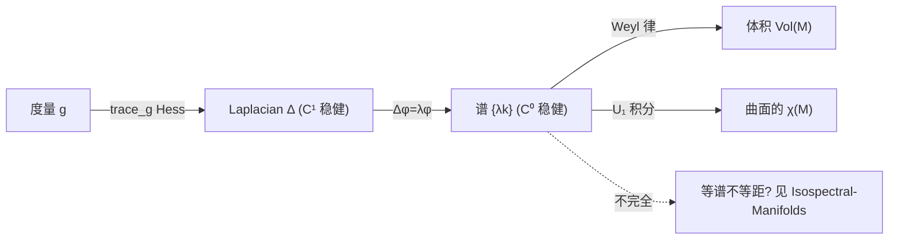

# Laplace 算子的谱 Spectrum of the Laplacian

## 直觉 Intuition

把黎曼流形 $(M,g)$ 想成一面鼓。敲一下, 它会以一组纯音振动。每个纯音对应一个"驻波" $\phi_k(m)\,h(t)$, 频率由 $\lambda_k$ 决定。**谱 $\{\lambda_k\}$ 就是这面鼓的全部固有频率清单。** 因为鼓的形状(度量 $g$)决定振动, 所以频率清单反过来编码了形状的某些信息——但不是全部(见 [[Isospectral-Manifolds]])。

关键: $\Delta$ 是从度量 $g$ 内蕴长出的二阶椭圆算子, 所以它的谱是几何不变量。但 $\Delta$ 依赖 $g$ 及其一阶导(仅 $C^1$ 稳健); 而谱本身是 $C^0$ 稳健的——这是 minimax 原理的礼物。

## 详细解释 Detailed

### 定义 Definitions
对光滑函数 $f:M\to\mathbb{R}$, Hess $f = Ddf$(协变导数)。Laplacian 取负迹(约定使特征值非负):
$$\Delta f = -\mathrm{trace}_g\,\mathrm{Hess}\,f.$$
等价地, 沿过 $m$ 的正交测地系 $\gamma_i$: $\Delta f(m)=-\sum_{i=1}^d \frac{d^2}{dt^2}f(\gamma_i(t))\big|_{t=0}$。用 Hodge star: $\Delta f = -\!*d\!*d$。在坐标下涉及 $g_{ij}$ 与 $\sqrt{\det g}$ (式 9.1)。

### 谱与特征函数 Spectrum & eigenfunctions
$\Delta \phi = \lambda\phi$。紧致流形上: 谱是 $\mathbb{R}_+$ 的离散无穷子集
$$\mathrm{Spec}(M)=\{0=\lambda_0<\lambda_1<\lambda_2<\cdots\},\quad \lambda_k\to\infty.$$
$\lambda_0=0$ 对应常值函数(因 $M$ 连通, 重数为 1)。每个 $\lambda_i$ 的特征空间有限维, 维数=**重数 multiplicity**。$\{\phi_k\}$ 构成 $L^2(M)$ 正交基, 任何 $f=\sum a_k\phi_k$, $a_k=\int_M f\phi_k$。不同特征值自动正交(由 $\int g\Delta f=\int\langle df,dg\rangle=\int f\Delta g$)。

### Minimax 原理 Minimax Principle
Dirichlet 商 $\mathrm{Dirichlet}(f)=\frac{\int_M\|df\|^2}{\int_M f^2}$。第一特征值
$$\lambda_1=\inf\Big\{\frac{\int\|df\|^2}{\int f^2}:\int f=0\Big\}.$$
一般地 (式 9.13):
$$\lambda_k = \inf_{\dim V=k+1}\sup_{f\in V}\mathrm{Dirichlet}(f).$$
几何意象: 两个正定二次型, 一个椭球一个球, 特征值=椭球主轴长度。要找第二主轴, 看所有过原点的平面截口里的"次大轴"。这解释了为什么每个函数都可展为特征函数级数, 且谱趋于无穷。

### 健壮性 Robustness
minimax 的推论 (Note 9.4.1.1): 谱只依赖 $g$ 本身, 不依赖其导数 → 比 $\Delta$ 更稳健 ($C^0$ vs $C^1$)。这使谱可在更一般的几何(如 §14.6)中定义。

### 上界应用 Upper-bound application
**Thm 164 (Gromov 1999):** 存在万能常数 $\mathrm{univ}(d,r)$ 使
$$\lambda_k \le \mathrm{univ}(d,r)\,\mathrm{Vol}(M)^{-2/d}\,k^{2/d},$$
其中 $r$ 是 Ricci 下界。证明思路: 把 $M$ 尽量密地填入度量球 $B(p_i,R)$, 用 Bishop 定理控制球数 $N$, 在每球移植比较空间 $S^d(\sqrt{(d-1)/r})$ 的第一 Dirichlet 特征函数, 再用 minimax。$k^{2/d}$ 的阶与 Weyl 律一致。

## 图解 Diagram

## 为什么重要 Why

- $\Delta$ 是任何黎曼流形上**典则的**椭圆算子, 使 Fourier 分析在流形上自动可用。
- 谱是连接"分析—几何—拓扑—物理"的枢纽: 体积(几何)、亏格(拓扑)、半经典极限(物理)都从谱读出。
- $\lambda_1$ 控制 Dirichlet 商、共振、乃至纯度量几何(如 Colding 公式), 见 [[First-Eigenvalue]]。

## 连接 Connections
- → [[Heat-Kernel-Asymptotics]]: 热核是读出谱首项(Weyl 律)与曲率不变量 $U_k$ 的工具。
- → [[Wave-Equation-Length-Spectrum]]: 波方程读出谱的精细结构(间隙、与测地流的关系)。
- → [[First-Eigenvalue]]: $\lambda_1$ 的极值控制。
- → [[Isospectral-Manifolds]]: 谱能恢复多少几何? 反问题。
- 跨课程: 暂无(待积累)。潜在——概率论 Brown 运动(热核)、PDE 中的椭圆算子理论。

## 来源 Sources
- Berger, *A Panoramic View of Riemannian Geometry*, Ch.9 §§9.1–9.4 (pp. 374–387). 见 [[Riemann-ch9]]。
- Bérard 1986 [135]; Chavel 1984 [325]; Gilkey 1995 [564].

## 待解决 Open Questions
- $\lambda_k$ 的**下界**(比上界难): 见 [[Heat-Kernel-Asymptotics]] 的 Thm 172。
- $N(\lambda)$ 在 Weyl 主项附近的精细分布 (Question 166): 对一般流形几乎一无所知。
- 高维 ($>6$) 标准球面是否由谱唯一决定? 仍开放。
