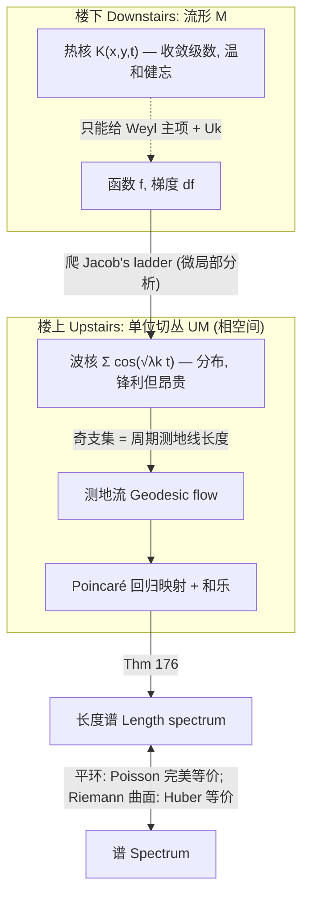

# 波方程与长度谱 Wave Equation & Length Spectrum

## 直觉 Intuition

热扩散是"健忘"的——它抹平细节, 只留体积和大体曲率。**波不会耗散**: 它永远振动, 沿测地线传播, 在周期轨道上自我叠加产生共振。Berger 的比喻: 要听清这些共振, 必须爬 **Jacob's ladder**——离开流形本体, 登上单位切丛 $UM$, 用微局部分析 (microlocal analysis) 与辛几何。代价昂贵, 但收获是谱的精细结构: 间隙、跳变, 以及与周期测地线(长度谱)的深刻对应。

核心戏剧张力: 波核 $\sum_k\cos(\sqrt{\lambda_k}\,t)$ 不再是函数, 而是分布——但正因为如此它携带的信息远比热核多。

## 详细解释 Detailed

### 热与波的根本差异 Heat vs wave
热方程: $h(t)=e^{-\lambda t}$ (指数衰减, 级数收敛)。波方程: $h(t)=e^{i\sqrt{\lambda}\,t}$ (永不衰减, 需分布理论)。波"沿测地线传播": 波前在 $UM$ 上的演化恰由测地流给出——"光沿测地线走"。

### Hörmander 渐近 Hörmander asymptotic
**Thm 173 (Hörmander 1968, Avakumović 1956):**
$$N(\lambda)=\frac{\mathrm{Vol}(M)\,\beta(d)}{(2\pi)^d}\lambda^{d/2}+O(\lambda^{(d-1)/2}).$$
把热核的 $o(\cdot)$ 改进为 $O(\lambda^{(d-1)/2})$。推论 (**Thm 174**): 谱间隙有下界——区间 $[a,b]$ ($b-a$ 足够大) 内 $\sqrt{\lambda}$ 的个数 $\ge C_M(b-a)a^d$。但 $C_M$ 非构造性, 不含几何。

**Thm 175 (Gromov 1996):** 奇数维, $|K|\le1$, $\mathrm{Inj}>1$ 时, $\#\{\sqrt{\lambda}\in[a,b]\}>C_d(b-a)^d\mathrm{Vol}(M)$ ($b>a+C_d'$)。用 Kac–Feynman–Kato 不等式 + Vafa–Witten/Bochner–Lichnerowicz/Atiyah–Singer, 爬到 Jacob's ladder 顶端才得到几何控制。

### 谱 ↔ 长度谱 Spectrum ↔ length spectrum
**Thm 176 (Chazarain 1974, Duistermaat–Guillemin 1975):** 分布 $\sum_i\cos(\sqrt{\lambda_i}\,t)$ 的奇支集(除 0 外)含于周期测地线长度集; 对一般流形, 是按长度 $L$ 求和的分布 $T_L$ 之并, 而 $T_L$ 由 Poincaré 回归映射 + 沿该测地线的和乐映射完全决定。

直觉: 投石入塘, 波沿周期测地线相向而行, 当频率 $=\frac{2\pi n}{L}$ 时共振 → 潮汐 → 奇异性。测地线**环路**(非闭合)共振不足, 不产生奇异性。

**Thm 177 (Colin de Verdière 1979, Duistermaat–Guillemin 1975):** 若所有测地线周期相同(长 $L$), 则 $\mathrm{Spec}(M)\subset\bigcap_k\big[\frac{2\pi}{L}(k+\frac\alpha4)^2-M,\;\frac{2\pi}{L}(k+\frac\alpha4)^2+M\big]$, 且每区间内特征值数 $\sim k$ 多项式。指标 $\alpha\in\{0,1,3,7\}$ (对应 $KP^n$, $K\in\{\mathbb{R},\mathbb{C},\mathbb{H},\mathbb{Ca}\}$)。

### Bérard 改进 / 负曲率 Bérard improvement
**Thm 179 (Bérard 1977):** 无共轭点或非正曲率时 $N(\lambda)=\text{主项}+O(\lambda^{(d-1)/2}\log\lambda)$。

### 特征函数与节点集 Eigenfunctions & nodal sets
- **量子遍历 (Thm 185):** 遍历流形上, 存在满密度指标列 $\{i(k)\}$ 使 $\lim\int_D\phi_{i(k)}^2=\frac{\mathrm{Vol}(D)}{\mathrm{Vol}(M)}$ (Shnirel′man 1973, Colin de Verdière 1985, 依赖 Egorov 的 Fourier 积分算子定理)。
- **Yau 猜想 (1982) + Donnelly–Fefferman 1988:** $c(g)\sqrt{\lambda}\le\mathrm{Vol}(\phi_\lambda^{-1}(0))\le c'(g)\sqrt{\lambda}$ (解析流形+度量)。常数 $c,c'$ 未知几何表达——开放。
- **Scarring (节点线沿周期测地线聚集):** 仅数值实验; 算术空间形式上 Sarnak 证明某种 scarring 不发生。定义因作者而异。

### 特殊情形 Special cases
- **平环 / Flat tori:** Poisson 公式 (式 9.14) 给出谱与长度谱的完美对应——对偶格 $\Lambda^*$ 点的模平方 ↔ 周期测地线长度。$\dim2$ 时 $\Lambda^*$ 与 $\Lambda$ 相似。
- **球面:** 调和多项式限制到 $S^d$, $\lambda_k=k(k+d-1)$, 重数 $\binom{d+k}{k}-\binom{d+k-1}{k-1}$。
- **Riemann 曲面:** **Huber 定理 (192/1959)** — 函数谱 $\Leftrightarrow$ 长度谱(因 $\dim2$+可定向+常曲率使 Poincaré/和乐平凡)。基于 Selberg 迹公式。
- **负曲率空间形式:** 期望谱分布为 GOE (随机高斯对称矩阵), 但算术 Riemann 曲面反例 (Luo–Sarnak 1995) → 量子混沌核心难题。

## 图解 Diagram: Jacob's Ladder

## 为什么重要 Why

- 波方程是连接**谱(分析)** 与**测地流(动力学/几何)** 的唯一桥梁——这是本章最具物理意味的核心(半经典极限 $\hbar\to0$)。
- 间隙控制 (Thm 174–175) 是判断"振动能否被频率分辨"的物理关键。
- 量子遍历/scarring 是量子混沌的数学主战场。

## 连接 Connections
- ← [[Spectrum-of-Laplacian]]: 谱的定义; ← [[Heat-Kernel-Asymptotics]]: 热给出主项, 波给出误差阶。
- → [[Isospectral-Manifolds]]: 等谱 ⇒ 长度谱相同; 但长度谱相同 ≠ 等谱(Vignéras 反例)。
- → [[First-Eigenvalue]]: $\lambda_1$ 与周期测地线有深层联系 (§9.9, Thm 205)。
- 跨课程: 辛几何 ($T^*M$); 物理量子混沌/随机矩阵 (GOE); 图论(图谱)。

## 来源 Sources
- Berger Ch.9 §§9.8–9.9, 9.11, 9.13 (pp. 402–426). 见 [[Riemann-ch9]]。
- Hörmander 1983 [737,738]; Guillemin–Sternberg 1977 [670]; Sarnak 1995 [1095].

## 待解决 Open Questions
- $N(\lambda)$ 是 $o(\lambda^{(d-1)/2})$ 还是 $O(\lambda^{(d-1)/2})$? (Question 178/180) 一般流形未知。
- Thm 175 能否只用"楼下"的波方程证明(不上 Jacob's ladder 顶端)?
- 量子遍历的"满密度"能否提升为"几乎所有"? scarring 是否真实存在?
- 算术负曲率空间形式的谱分布为何偏离 GOE? — 量子混沌核心开放问题。
